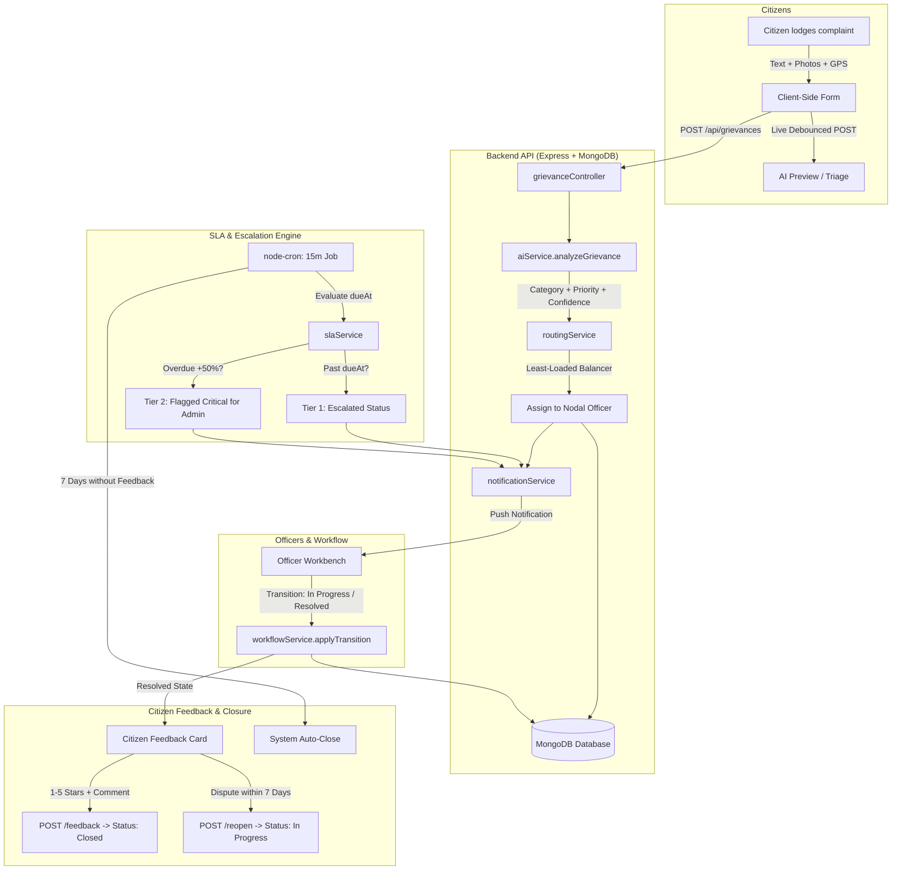

# CivicSetu (नागरिक सेतु) — AI-Driven Municipal Grievance Redressal Platform

> **Project-Based Learning (PBL) Prototype — Semester 5**  
> An intelligent civic grievance routing and accountability bridge connecting citizens, ward officers, and municipal executives with automated AI classification, SLA-enforced escalations, and real-time public audit tracking.

---

## 1. Project Overview & Problem Statement

Urban local bodies receive thousands of complaints daily concerning broken roadways, water outages, garbage overflow, and public hazards. Traditional municipal grievance systems suffer from:
1. **Manual Triage Delays:** Complaints sit in generic inboxes for days before being dispatched to the correct department.
2. **Opacity & Lost Public Trust:** Citizens receive opaque reference numbers with no visibility into which officer is handling the issue or when it will be resolved.
3. **Lack of Enforceable SLAs:** No automated escalation mechanisms exist when service level agreement (SLA) deadlines are breached.
4. **Superficial Resolutions:** Tickets are often prematurely closed without verified photographic proof or citizen feedback.

**CivicSetu** solves these core challenges through:
- **Instant AI Triage & Entity Extraction:** Automatically classifies unstructured complaint text into 9 municipal departments, assigns urgency-backed SLA clocks (24h to 168h), and pinpoints duplicates within a 200m radius.
- **Automated Ward Routing:** Dispatches grievances directly to the least-loaded nodal officer in the responsible ward.
- **Continuous SLA Escalation Engine:** A 15-minute background cron evaluates resolution targets, escalating breached tickets to Tier 1 and Tier 2 (Critical priority for Municipal Commissioners).
- **Two-Stage Redressal & Citizen Feedback:** Requires photographic proof from officers before status can reach "Resolved", followed by citizen satisfaction rating (1–5 stars) or 7-day dispute reopening.

---

## 2. Feature Matrix by Role

| Role | Key Capabilities & Features |
| :--- | :--- |
| **Citizen** | • Multi-step grievance lodge form with live client-side AI preview.<br>• Interactive Leaflet map with geo-pinning & ward auto-detection.<br>• Drag-and-drop evidence image attachments (up to 4 files, max 5MB).<br>• Public tracking portal by unique reference ID (e.g. `GRV-2026-000001`) with timeline audit.<br>• Notification bell & notifications center (routing, status changes, SLA notices).<br>• Interactive 5-star resolution feedback and 7-day dispute reopening modal. |
| **Municipal Officer** | • Department-isolated resolution desk & assigned queue.<br>• Status workflow transitions (`Assigned` &rarr; `In Progress` &rarr; `Awaiting Verification` &rarr; `Resolved`).<br>• Internal investigation remarks (hidden from public/citizens).<br>• Category override tool with mandatory justification log.<br>• Internal reassignment to colleague officers within the department.<br>• Resolution submission with mandatory field completion summary and proof images.<br>• Departmental performance telemetry (SLA compliance rate, citizen rating KPI). |
| **Municipal Admin** | • Executive citywide overview (open grievances, SLA breach count, satisfaction KPI).<br>• Departmental leaderboard and comparative analytics charts.<br>• Interactive municipal GIS Map with cluster markers, status filtering, and popups.<br>• Dedicated **Escalated & Overdue** command view for emergency intervention.<br>• Slide-over inspector drawer for reassignment and emergency priority overrides.<br>• Department and user account directory management.<br>• **Demo Controls Panel:** "Run SLA check now" & "Simulate SLA breach" for live evaluators. |

---

## 3. Technology Stack

- **Frontend:** React 18, Vite, Tailwind CSS, Lucide Icons, Leaflet / React-Leaflet, Recharts.
- **Backend:** Node.js v20+, Express 4, Mongoose ODM, JSON Web Tokens (JWT), Bcrypt.js.
- **Background Jobs:** Node-Cron (`jobs/escalationJob.js` running every 15 minutes).
- **Security & Hygiene:** Helmet headers, CORS policy, Multer image upload limits, Express-Rate-Limit on auth & AI endpoints, RBAC middleware.
- **Database:** MongoDB (Local or MongoDB Atlas).

---

## 4. Architecture & System Flow



---

## 5. Folder Structure

```
SEM 5 PBL/
├── client/                     # Frontend Vite + React application
│   ├── src/
│   │   ├── components/         # Reusable UI kit, auth guards, notifications, maps
│   │   ├── context/            # AuthContext, ThemeContext, ToastContext, NotificationContext
│   │   ├── layouts/            # PublicLayout, DashboardLayout (role-aware nav config)
│   │   ├── pages/              # Landing, HowItWorks, Track, Login, Register, Profile
│   │   │   └── dashboard/      # Citizen, Officer, and Admin console pages
│   │   ├── services/           # Axios API service clients (auth, grievances, officer, admin)
│   │   └── utils/              # Shared constants, date utilities, coordinate helpers
├── server/                     # Backend Node.js Express REST API
│   ├── controllers/            # auth, grievance, officer, admin, ai, notification, public
│   ├── middleware/             # auth, RBAC, error handler, validators, upload (multer)
│   ├── models/                 # User, Department, Grievance, Notification
│   ├── routes/                 # Express API routes
│   ├── services/               # workflowService, routingService, slaService, notificationService
│   │   └── ai/                 # aiService (swappable NLP/LLM interface)
│   ├── jobs/                   # escalationJob (node-cron SLA monitoring)
│   └── scripts/                # seed.js, seedGrievances.js, testAI.js
├── package.json                # Root monorepo scripts
└── README.md                   # System documentation and demo script
```

---

## 6. The AI Layer: How It Works & Swappable Design

CivicSetu abstracts AI operations behind a clean, pluggable interface (`server/services/ai/aiService.js`):

```js
analyzeGrievance({ title, description, location }) => Promise<{
  department: string,
  category: string,
  priority: 'Low' | 'Medium' | 'High' | 'Critical',
  confidence: number,
  keywords: string[],
  urgencySignals: string[],
  summary: string,
  reasoning: string,
  alternatives: Array<{ category: string, confidence: number }>,
  needsManualReview: boolean,
  provider: string,
  isMock: boolean
}>
```

### Current Implementation: Deterministic Rule-Based NLP (`rule-based-nlp-v1`)
- Tokenizes complaint text and scores weighted civic n-grams across 9 municipal disciplines.
- Evaluates **urgency signals** (e.g., words like *"sparking"*, *"dengue"*, *"open manhole"*, *"hospital access"*) to dynamically elevate priority to **High** or **Critical**.
- Computes **calibrated confidence scores** (typically 88%–96%). Ambiguous complaints trigger `needsManualReview: true`.
- Employs **Haversine geo-distance** to detect duplicate tickets within 200 meters.
- **Why this design?** 100% deterministic, zero latency, zero third-party API costs, and works completely offline during academic evaluations.

### Swapping to a Live LLM (Gemini / OpenAI)
To integrate an LLM provider:
1. Create `server/services/ai/geminiProvider.js` implementing `analyzeGrievance`.
2. Add your `GEMINI_API_KEY` to `server/.env`.
3. Set `AI_PROVIDER=gemini` in `server/.env`.  
The application dynamically selects the active provider via `server/services/ai/aiService.js` with zero modifications required in controllers, routes, or frontend components.

---

## 7. API Overview

| Method | Endpoint | Access | Purpose |
| :--- | :--- | :--- | :--- |
| `POST` | `/api/auth/register` | Public | Citizen registration (strictly forces `role: citizen`, rate-limited). |
| `POST` | `/api/auth/login` | Public | User authentication; returns JWT session token (rate-limited). |
| `GET` | `/api/auth/me` | Protected | Current authenticated user profile. |
| `GET` | `/api/public/stats` | Public | Aggregated municipal metrics for landing page. |
| `GET` | `/api/grievances/track/:trackingId` | Public | Unauthenticated public ticket tracking. |
| `POST` | `/api/grievances` | Citizen | Lodge new grievance with multipart image attachments. |
| `GET` | `/api/grievances/my` | Citizen | Citizen's grievances with filters, search, and pagination. |
| `POST` | `/api/grievances/:id/feedback` | Citizen | Submit 1–5 star rating and close resolved ticket. |
| `POST` | `/api/grievances/:id/reopen` | Citizen | Dispute and reopen resolved grievance within 7 days. |
| `POST` | `/api/ai/analyze-preview` | Protected | Real-time classification preview as citizen types. |
| `GET` | `/api/officer/grievances` | Officer | Department-isolated officer grievance queue. |
| `PATCH`| `/api/officer/grievances/:id/status` | Officer | Update ticket workflow state (`In Progress`, `Resolved`, etc.). |
| `POST` | `/api/officer/grievances/:id/remarks` | Officer | Append internal field notes (hidden from citizens). |
| `GET` | `/api/admin/overview` | Admin | Executive summary metrics, breach counts, and trends. |
| `GET` | `/api/admin/map` | Admin | GeoJSON coordinates and statuses for GIS map. |
| `POST` | `/api/admin/sla/run-check` | Admin | Manually trigger the background SLA evaluation cron. |
| `POST` | `/api/admin/sla/simulate-breach` | Admin | **Demo Tool**: Back-date SLA due time and escalate live. |
| `GET` | `/api/notifications` | Protected | Paginated user notifications with unread filter. |
| `GET` | `/api/notifications/unread-count` | Protected | Polled every 30s for live badge updates. |

---

## 8. Installation & Setup

### Prerequisites
- Node.js (v18 or higher, v20+ recommended)
- MongoDB running locally at `mongodb://127.0.0.1:27017` or a MongoDB Atlas URI

### Step 1: Install Dependencies
```bash
# Run from repository root
npm run install-all
```

### Step 2: Environment Configuration
The backend server runs on port **5010** (to avoid port conflicts):

**`server/.env`**:
```env
PORT=5010
MONGO_URI=mongodb://127.0.0.1:27017/civicsetu
JWT_SECRET=civicsetu_super_secret_jwt_key_2026_dev
JWT_EXPIRES_IN=7d
CLIENT_URL=http://localhost:5173
AI_PROVIDER=rule
ESCALATION_JOB_ENABLED=true
```

**`client/.env`**:
```env
VITE_API_URL=http://localhost:5010/api
```

### Step 3: Seed Database
```bash
# Seed 9 departments, 21 officers, 12 citizens, 64 grievances, and notifications
npm run seed
```

### Step 4: Run AI Benchmark Test
```bash
npm run test:ai
```

### Step 5: Start Development Server
```bash
npm run dev
```
- Client runs at: `http://localhost:5173`
- Backend API runs at: `http://localhost:5010`

---

## 9. Demo Credentials

| Role | Email | Password | Assigned Scope / Details |
| :--- | :--- | :--- | :--- |
| **Municipal Admin** | `admin@civicsetu.gov.in` | `Admin@123` | Dr. Neha Patel (Municipal Commissioner & CEO) |
| **Roads Officer** | `roads.officer1@civicsetu.gov.in` | `Officer@123` | Er. Rajesh Verma (Executive Engineer - Roads) |
| **Water Officer** | `water.officer1@civicsetu.gov.in` | `Officer@123` | Suresh Menon (Hydro-Engineer - Water Supply) |
| **Waste Officer** | `waste.officer1@civicsetu.gov.in` | `Officer@123` | Rameshwar Yadav (Sanitation Chief Supervisor) |
| **Citizen 1** | `citizen1@example.com` | `Citizen@123` | Aarav Sharma (Ward 1 - Central) |
| **Citizen 2** | `citizen2@example.com` | `Citizen@123` | Diya Mukherjee (Ward 2 - North) |

---

## 10. Evaluator Demo Script (6–8 Minutes)

### Step 1: Landing Page & Public Features (1 Minute)
1. Open `http://localhost:5173`.
2. Notice the live **Municipal Impact Metrics** band (dynamic resolved count, average resolution time, citizens served).
3. Click **"How It Works"** in the top navigation to review the 10-stage lifecycle and the AI architecture explanation.
4. Click **"Track Status"** in the header. Enter `GRV-2026-000001` to show unauthenticated public tracking with transparent timeline logs.

### Step 2: Citizen Lodging with Live AI Preview (2 Minutes)
1. Sign in as Citizen: `citizen1@example.com` / `Citizen@123`.
2. Navigate to **"Lodge Grievance"**.
3. In Step 1, type in the title:  
   `"No water supply for three days in Sector 4"`  
   Notice the **AI Triage card** instantly updates with `Water Supply Disruption`, **High Priority (48h SLA)**, and 95% confidence score.
4. Complete Step 2: click on the map to pin coordinates in Ward 2.
5. Complete Step 3: attach an image and click **"Submit Grievance"**.
6. A toast confirms submission, and an instant notification appears in the top bell icon: *"Your complaint was routed to Water Supply"*.

### Step 3: Officer Workbench & Resolution (2 Minutes)
1. Sign in as Officer: `water.officer1@civicsetu.gov.in` / `Officer@123`.
2. Go to **"Assigned Grievances"**: notice the new ticket appears in the queue with a color-coded **SlaBadge** showing countdown time.
3. Open the **Workbench** for the ticket.
4. Transition state to **"In Progress"** and enter a note: *"Work squad dispatched to inspect valve manifold."*
5. Add an **Internal Remark** (show that internal notes have an orange badge and are hidden from citizens).
6. Click **"Resolve Grievance"**, enter the redressal summary, and submit. Status transitions to **Resolved**.

### Step 4: Admin Console & Live SLA Breach Simulation (2 Minutes)
1. Sign in as Admin: `admin@civicsetu.gov.in` / `Admin@123`.
2. Open the **Overview Dashboard**: view the KPI summary cards, Department Leaderboard, and **Citizen Satisfaction (4.6 ★)**.
3. Check the **Map View**: demonstrate cluster markers, ward boundaries, and interactive grievance popups.
4. In the **Overview**, locate the **Demo Tools Card** on the right side:
   - Select an active ticket from the dropdown (e.g. `GRV-2026-000002`).
   - Click **"Simulate Breach & Check"**.
   - The backend sets `sla.dueAt` into the past and executes the SLA evaluation engine.
5. Open **"Escalated & Overdue"** from the sidebar: the ticket now displays with a bright red **Breached** badge and a **Tier 1 Escalation** pill.

### Step 5: Citizen Feedback & Redressal Closure (1 Minute)
1. Switch back to Citizen: `citizen1@example.com`.
2. On the **Citizen Dashboard**, point out the alert banner: *"You have resolved grievances awaiting your feedback"*.
3. Click to open the resolved grievance detail page.
4. Point out the **Citizen Redressal & Feedback** card:
   - Select **5 Stars** with hover animations.
   - Enter *"Pothole repaired smoothly, thank you!"*
   - Click **"Submit Feedback & Close"**.
5. The ticket immediately updates to **Closed**, displays the submitted rating read-only, and updates the citywide satisfaction metrics!
